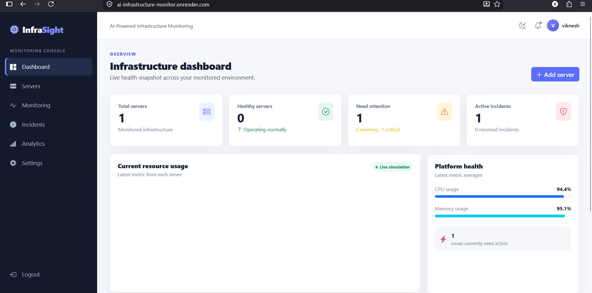
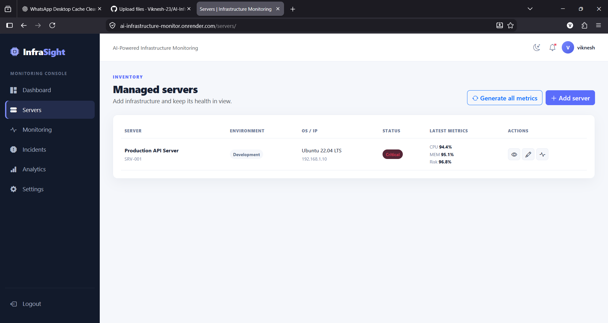
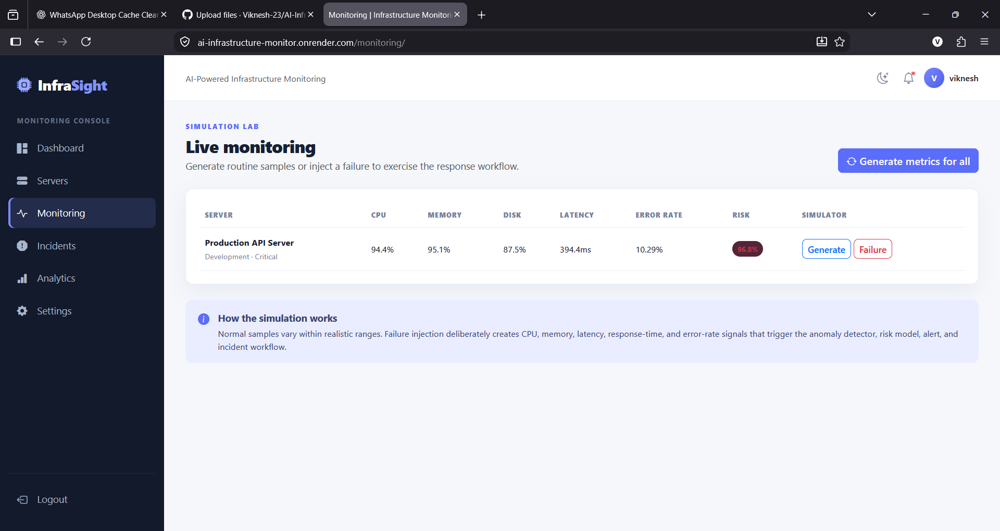
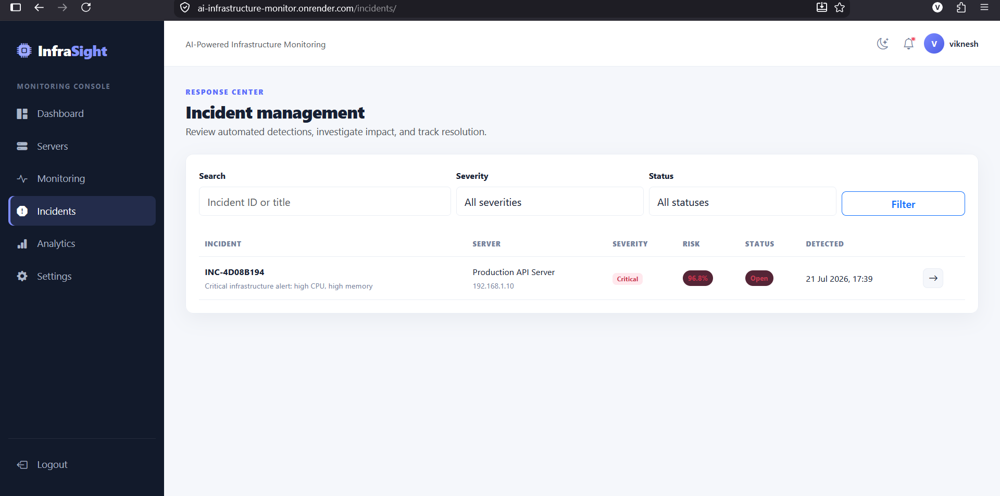
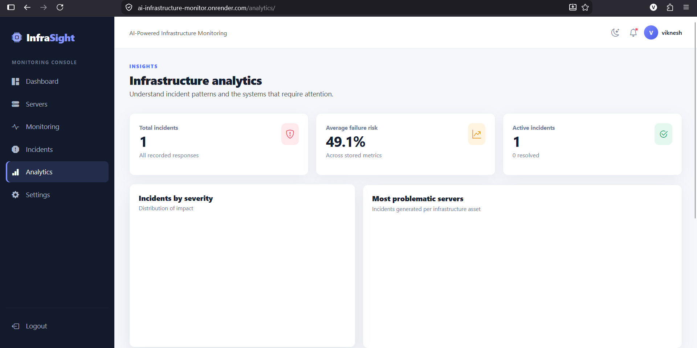

# AI-Powered Predictive IT Infrastructure Monitoring

🌐 Live Demo: https://ai-infrastructure-monitor.onrender.com

📂 Source Code: https://github.com/Viknesh-23/AI-Infrastructure-Monitor

A Flask application for simulating server telemetry, detecting anomalous behaviour with Isolation Forest, estimating failure risk, and managing AI-assisted incidents. It works fully offline: Gemini analysis automatically falls back to clear rule-based diagnostics when an API key or network connection is unavailable.

## Screenshots

### Dashboard


### Server Failure Prediction


### Live Monitoring


### Incident Management


### Infrastructure Analytics


## Tech Stack

- Python
- Flask
- SQLAlchemy
- PostgreSQL
- Scikit-learn
- Isolation Forest
- Google Gemini API
- Bootstrap 5
- Chart.js
- HTML, CSS & JavaScript
- Render
- Git & GitHub

## Features

- Account registration and session-based authentication.
- Server inventory with development, testing, and production environments.
- Normal and failure telemetry simulation through HTML and JSON API endpoints.
- Isolation Forest detection after sufficient history, with threshold rules for cold starts.
- Explainable 0–100% failure-risk scoring and automatic severity classification.
- Deduplicated active incidents, alerts, investigation workflow, and healthy-state reset on resolution.
- Gemini 2.5 Flash root-cause analysis with a dependable local fallback.
- Responsive Bootstrap dashboard, persisted light/dark mode, and Chart.js trend/analytics views.
- SQLite for local use and PostgreSQL through `DATABASE_URL` for Render.

## How It Works

1. **Server Monitoring**
   - Collects CPU, memory, disk, and other server metrics.

2. **Anomaly Detection**
   - Isolation Forest analyzes the metrics and identifies abnormal server behaviour.

3. **Failure Risk Prediction**
   - The system calculates a failure risk score from 0–100%.

4. **Automatic Incident Creation**
   - When the risk exceeds the configured threshold, an incident is automatically created.

5. **AI Root Cause Analysis**
   - Google Gemini analyzes the incident and provides possible causes and recommended actions.
   - A local rule-based fallback is used when Gemini is unavailable.

6. **Monitoring Dashboard**
   - Administrators can view server health, risk scores, incidents, historical metrics, and analytics from the dashboard.

## Project Structure

```text
AI-Infrastructure-Monitor/
├── models/          # Database models
├── routes/          # Flask routes and API endpoints
├── services/        # ML and AI services
├── scripts/         # Database/data utility scripts
├── static/          # CSS and JavaScript files
├── templates/       # HTML templates
├── app.py           # Main Flask application
├── config.py        # Application configuration
├── render.yaml      # Render deployment configuration
└── requirements.txt # Python dependencies
```

## Local setup

1. Create and activate a virtual environment.

   ```powershell
   py -m venv .venv
   .\.venv\Scripts\Activate.ps1
   ```

2. Install dependencies and create local configuration.

   ```powershell
   pip install -r requirements.txt
   Copy-Item .env.example .env
   ```

3. Seed the demonstration workspace, then start Flask.

   ```powershell
   python scripts/seed_data.py
   flask --app app run --debug
   ```

Open `http://127.0.0.1:5000` in your browser. Create an account or use your configured administrator credentials to access the dashboard.
To initialise an empty database instead, run `flask --app app init-db`.

## Configuration

| Variable | Purpose |
| --- | --- |
| `SECRET_KEY` | Long, random application session secret. |
| `DATABASE_URL` | SQLite URL locally or a PostgreSQL connection URL in deployment. Legacy `postgres://` URLs are converted automatically. |
| `GEMINI_API_KEY` | Optional Google Gemini key. Without it the application uses the local fallback. |
| `INCIDENT_RISK_THRESHOLD` | Minimum risk percentage for incident creation (default `65`). |
| `MAX_METRICS_PER_SERVER` | Recent samples retained per server (default `500`). |
| `SESSION_COOKIE_SECURE` | Set `true` behind HTTPS, such as Render. |

## JSON monitoring API

Authenticated browser sessions can use these endpoints (the UI calls them with Fetch):

| Method | Endpoint | Action |
| --- | --- | --- |
| `POST` | `/monitoring/api/server/<server_id>/metrics` | Generate a normal telemetry sample. |
| `POST` | `/monitoring/api/server/<server_id>/simulate-failure` | Generate a high-risk failure sample. |
| `GET` | `/monitoring/api/server/<server_id>/history` | Return the recent chart history. |

Each generation response includes the scored metric, updated server status, and any active incident.

## Deployment on Render

The included `render.yaml` provisions a web service and PostgreSQL database. Push the repository to a Git provider, create a Render Blueprint from that file, then add `GEMINI_API_KEY` if AI analysis is desired. Render starts the service with:

```text
gunicorn app:app
```

`preDeployCommand` creates database tables. Seed data is intentionally not loaded in deployment.
